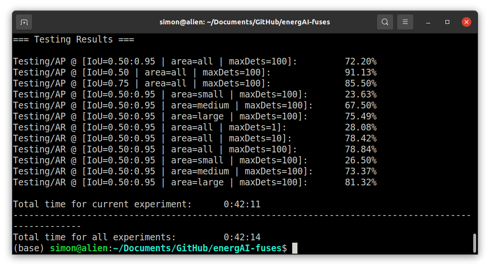
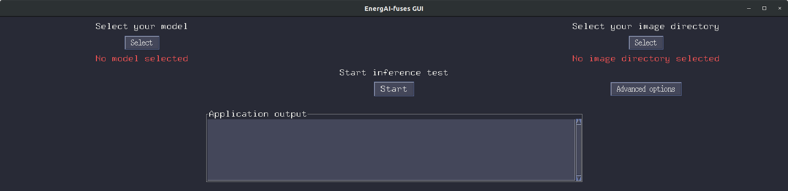
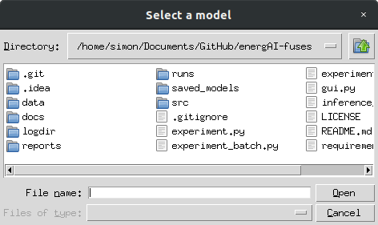
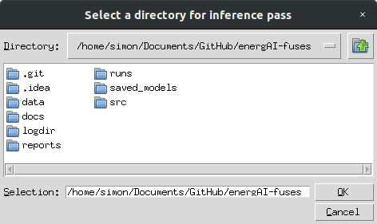
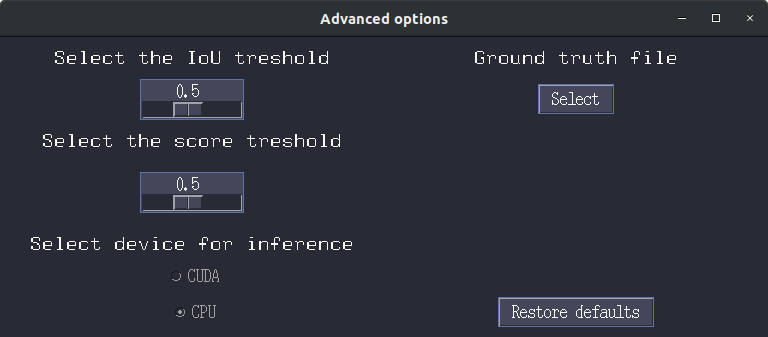
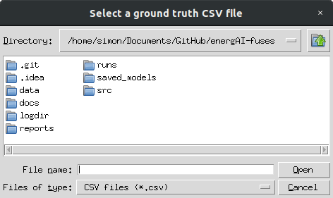
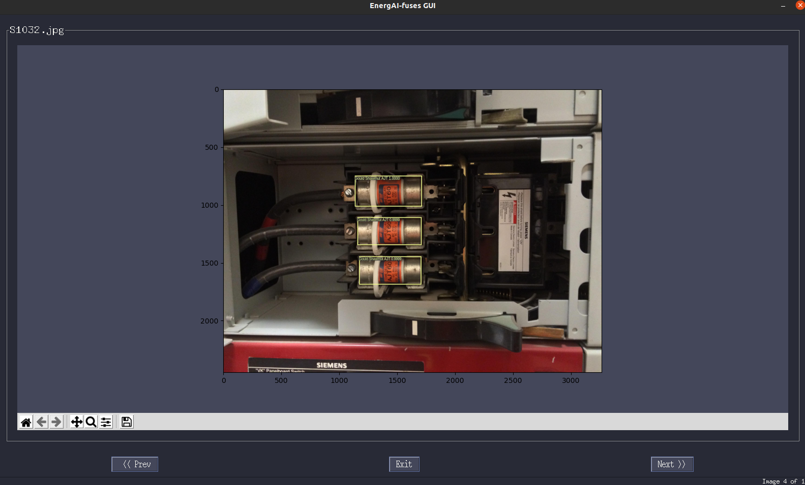

# EnergAI : Fuse Detection

This repository contains the fuse detection code for the EnergAI 
project and the following article published in IEEE 'xxx': 

[***Electric Power Fuse Identification with Deep Learning***](about:blank)

## Authors
* [Simon Giard-Leroux](https://github.com/sgiardl) (Université de Sherbrooke / CIMA+)
* [Guillaume Cléroux](https://github.com/gcleroux) (Université de Sherbrooke)
* [Shreyas Sunil Kulkarni](https://github.com/Kuyas) (Birla Institute of Technology and Science, Pilani / Amazon)
* [François Bouffard](https://www.mcgill.ca/ece/francois-bouffard) (McGill University)
* [Martin Vallières](https://github.com/mvallieres) (Université de Sherbrooke)

## Acknowledgements

The authors would like to thank all partner organizations 
that were involved during this project: CIMA+, HEXACODE Solutions, 
Université de Sherbrooke and Université McGill, as well as the 
organizations that supplied the funding for this project: 
CIMA+, HEXACODE Solutions, InnovÉÉ, Mitacs and the 
Natural Sciences and Engineering Research Council of Canada 
(NSERC). Martin Vallières also acknowledges funding from the 
Canada CIFAR AI Chairs Program.

## Introduction
This project implements a supervised learning PyTorch-based end-to-end object detection pipeline for the purpose of detecting and
classifying fuses in low-voltage electrical installations.

## Installation
Install dependencies in a Python environment:
```
$ pip install -r requirements.txt
```
The use of a CUDA GPU with at least 24 GB of VRAM is required to run the experiments
in this repository. To enable users with lower specifications to train a model and obtain
a trained model quickly, a 'quick run' script has been created, see the section below for
details on how to run this script.

## Module Details: experiment.py

### Description

This file enables users to run a single experiment with the specified parameters using the developed pipeline.

### Arguments

| Short 	      | Long              	               | Type   | Default           	                | Choices                                                                       	                                                                             | Description                                                                   	                                     |
|--------------|-----------------------------------|--------|------------------------------------|-------------------------------------------------------------------------------------------------------------------------------------------------------------|---------------------------------------------------------------------------------------------------------------------|
| `-nw`    	   | `--num_workers`           	       | int    | `multiprocessing.cpu_count()`    	 | 	                                                                                                                                                           | Number of CPU threads for multiprocessing purposes                                                                  |
| `-e`    	    | `--epochs`          	             | int    | `200`                	             | 	                                                                                                                                                           | Number of epochs                        	                                                                           |
| `-b`   	     | `--batch`  	                      | int    | `1` 	                              | 	                                                                                                                                                           | Batch size                                                  	                                                       |
| `-vs`   	    | `--validation_size`               | float  | `0.1`               	              | 	                                                                                                                                                           | Size of validation set (float as proportion of dataset) 	                                                           |
| `-ts`   	    | `--test_size`           	         | float  | `0.1`               	              | 	                                                                                                                                                           | Size of test set (float as proportion of dataset)	                                                                  |
| `-s`    	    | `--image_size`           	        | int    | `1024`    	                        | 	                                                                                                                                                           | Resize the images to size * size                                                                                    |
| `-da`    	   | `--data_aug`         	            | float  | `0.25`         	                   | 	                                                                                                                                                           | Value of data augmentation for training dataset                                                                     |
| `-norm`   	  | `--normalize`        	            | str    | `precalculated`                    | `'precalculated'`<br>`'calculated'`<br>`'disabled'`	 	                                                                                                      | Normalize the training dataset by mean & std using precalculated values, calculated values or disabled            	 |
| `-lr`   	    | `--learning_rate`                 | float  | `0.0003`                           | 	                                                                                                                                                           | Learning rate for Adam optimizer                                                                                    |
| `-wd`   	    | `--weight_decay`                  | float  | `0.00003`                          | 	                                                                                                                                                           | Weight decay (L2 penalty) for Adam optimizer                                                                        |
| `-mo`   	    | `--model`                         | str    | `'fasterrcnn_resnet50_fpn'`        | `'fasterrcnn_resnet50_fpn'`<br>`'fasterrcnn_mobilenet_v3_large_fpn'`<br>`'fasterrcnn_mobilenet_v3_large_320_fpn'`<br>`'retinanet_resnet50_fpn'`<br>`'detr'` | Object detection model                                                                                              |
| `-esp`   	   | `--es_patience` 	                 | int    | `None`            	                | 	                                                                                                                                                           | Early stopping patience (number of epochs without improvement)                                                      |
| `-esd`       | `--es_delta`        	             | float  | `0`                 	              | 	                                                                                                                                                           | Early stopping delta (tolerance to evaluate improvement)                     	                                      |
| `-mp`    	   | `--mixed_precision`  	            | bool   | `False`                            | 	                                                                                                                                                           | Boolean to use mixed precision                  	                                                                   |
| `-g`   	     | `--gradient_accumulation`         | int    | `1`            	                   | 	                                                                                                                                                           | Gradient accumulation size (1 : no gradient accumulation)                                                           |
| `-gc`   	    | `--gradient_clip`    	            | float  | `5`                 	              | 	                                                                                                                                                           | Gradient clipping value                                                          	                                  |
| `-ss`   	    | `--seed_split`      	             | int 	  | `54288`            	               | 	                                                                                                                                                           | Random seed for training, validation and test splitting           	                                                 |
| `-si`   	    | `--seed_init`      	              | int 	  | `54288`            	               | 	                                                                                                                                                           | Random seed for RNG initialization 	                                                                                |
| `-dt`   	    | `--deterministic`        	        | bool 	 | `False`             	              | 	                                                                                                                                                           | Boolean to force deterministic behavior           	                                                                 |
| `-no-pt`   	 | `--no_pretrained`        	        | bool 	 | `False`             	              | 	                                                                                                                                                           | If specified, the loaded model will not be pretrained           	                                                   |
| `-no-sv`   	 | `--no_save_model`        	        | bool 	 | `False`             	              | 	                                                                                                                                                           | If specified, the trained model will not be saved           	                                                       |
| `-no-gi`   	 | `--no_google_images`        	     | bool 	 | `False`             	              | 	                                                                                                                                                           | If specified, the Google Images photos will be excluded from the training subset          	                         |
| `-ltm`   	   | `--log_training_metrics`        	 | bool 	 | `False`             	              | 	                                                                                                                                                           | If specified, the AP and AR metrics will be calculated and logged for training set          	                       |
| `-sl`   	    | `--save_last`        	            | bool 	 | `False`             	              | 	                                                                                                                                                           | Specify whether to save/use for inference testing the last model, otherwise the best model will be used           	 |
| `-kcv`   	   | `--k_cross_valid`        	        | int 	  | `1`             	                  | 	                                                                                                                                                           | Number of folds for k-fold cross validation (1 = no k-fold cross validation)           	                            |

If the model architecture chosen is `detr`, the following arguments are included.

| Long              	            | Type  | Default           	 | Description                                                                   	 |
|--------------------------------|-------|---------------------|---------------------------------------------------------------------------------|
| `--set_cost_class`           	 | float | `1`    	            | Class coefficient in the matching cost                                          |
| `--set_cost_bbox`           	  | float | `5`    	            | L1 box coefficient in the matching cost                                         |
| `--set_cost_giou`           	  | float | `2`    	            | giou box coefficient in the matching cost                                       |
| `--eos_coef`           	       | float | `0.1`    	          | Relative classification weight of the no-object class                           |


``-h``, ``--help``
show this help message and exit

### Examples of basic use:

To run a single experiment:
```
python experiment.py --epochs 3
```

To view log runs and hyperparameters in tensorboard:
```
tensorboard --logdir=logdir
```

## Module Details: experiment_batch.py

### Description

This file enables users to run a batch of different experiments using the 
developed pipeline. The parameters for each experiment need to be specified 
in a '.json' file. The following structure needs to be followed to specify the 
'.json' batch fixed and variable parameters:
```
{
    "fixed":{
        "-b": "20"
    },

    "variable":{
        "-lr": ["3e-4", "3e-5", "3e-6"],
        "-wd": ["3e-3", "3e-4", "3e-5"]
    }
}
```

The fixed parameters will be fixed for all experiments, while all possible 
combinations of variable parameters will be evaluated. In the above example,
for 3*3=9 total variable parameters combinations possible, the following 
9 experiments will be executed:
```
experiment.py -b 20 -lr 3e-4 -wd 3e-3
experiment.py -b 20 -lr 3e-4 -wd 3e-4
experiment.py -b 20 -lr 3e-4 -wd 3e-5
experiment.py -b 20 -lr 3e-5 -wd 3e-3
experiment.py -b 20 -lr 3e-5 -wd 3e-4
experiment.py -b 20 -lr 3e-5 -wd 3e-5
experiment.py -b 20 -lr 3e-6 -wd 3e-3
experiment.py -b 20 -lr 3e-6 -wd 3e-4
experiment.py -b 20 -lr 3e-6 -wd 3e-5
```

The batch parameters '.json' files for experiment phases A, B, C, D 
and the quick run files are stored inside the '/runs' directory. The '/runs'
directory contains the following '.json' files:
- **A1_fasterrcnn_experiment.json**: Experiment batch for phase A, Faster R-CNN architecture
- **A2_retinanet_experiment.json**: Experiment batch for phase A, RetinaNet architecture
- **A3_detr_experiment.json**: Experiment batch for phase A, DETR architecture
- **B1_size_experiment.json**: Experiment batch for phase B, 512x512 & 1024x1024 image sizes
- **B1_size_experiment_2048.json**: Experiment batch for phase B, 2048x2048 image size (requires around 48 GB VRAM)
- **B2_pretrained_experiment.json**: Experiment batch for phase B, pretrained vs from scratch model
- **B3_gi_experiment.json**: Experiment batch for phase B, Google Images included or excluded
- **C_sensitivity_experiment.json**: Experiment batch for phase C, all 10 initialization seeds
- **C_sensitivity_experiment_1.json**: Experiment batch for phase C, first 5 initialization seeds (split for convenience)
- **C_sensitivity_experiment_2.json**: Experiment batch for phase C, last 5 initialization seeds (split for convenience)
- **D_final_training.json**: Experiment batch for phase D, final model training
- **quick_run.json**: Quick run for low-resource intensive quick model training

### Arguments

| Short 	   | Long              	  | Type | Description                                                                   	 |
|-----------|----------------------|------|---------------------------------------------------------------------------------|
| `-p`    	 | `--path`           	 | str  | Experiment settings .json file path                                             |
``-h``, ``--help``
show this help message and exit

### Examples of basic use:

To run a batch of experiments for which the fixed & variable parameters are
specified in a '.json' file:
```
python experiment_batch.py --path runs/A1_fasterrcnn_experiment.json
```

### Quick Run

A quick run script has been created to allow users with low VRAM GPU's to train
a model with a batch size of 2 for 10 epochs that will produce results in a 
relatively short time. To execute the quick run script:

```
python experiment_batch.py --path runs/quick_run.json
```

After training, testing results will be printed in the console and should be
approximately equal to: 


## Module Details: experiment_batch_all.py

### Description

This file enables users to run all experiments for phases A, B, C and D from
a single file. It will run the following `experiment_batch.py` calls 
sequentially:
- A1_fasterrcnn_experiment.json
- A2_retinanet_experiment.json
- A3_detr_experiment.json
- B1_size_experiment.json
- B1_size_experiment_2048.json
- B2_pretrained_experiment.json
- B3_gi_experiment.json
- C_sensitivity_experiment.json
- D_final_training.json

### Examples of basic use:

To run all experiments in one line:
```
python experiment_batch_all.py
```

## Module Details: inference_test.py

### Description

This file enables users to run an inference test on a saved model and show model 
predictions and ground truths boxes on the images.

### Arguments

| Short 	      | Long              	            | Type    	 | Default         | Choices                                                | Description                                                                                                         |
|--------------|--------------------------------|-----------|-----------------|--------------------------------------------------------|---------------------------------------------------------------------------------------------------------------------|
| `-mfn`       | `--model_file_name`            | str     	 | 	               |                                                        | File name of the saved model to load                                                                                |
| `-norm`   	  | `--normalize`        	         | str       | `precalculated` | `'precalculated'`<br>`'calculated'`<br>`'disabled'`	 	 | Normalize the training dataset by mean & std using precalculated values, calculated values or disabled            	 |
| `-b`   	     | `--batch`         	            | int     	 | `1`             |                                                        | Batch size                                                                                                          |
| `-iou`   	   | `--iou_threshold`              | float     | `0.5`           |                                                        | Intersection-over-union (IOU) threshold to filter bounding box predictions                                          |
| `-sc`   	    | `--score_threshold`            | float     | `0.5`           |                                                        | Objectness score threshold to filter bounding box predictions                                                       |
| `-no-gi`   	 | `--no_google_images`        	  | bool 	    | `False`         | 	                                                      | If specified, the Google Images photos will be excluded from the training subset          	                         |
| `-gui`   	   | `--with_gui`        	          | bool 	    | `False`         | 	                                                      | If specified, the inference results will be shown in the GUI application          	                                 |
| `-img`   	   | `--image_path`        	        | str 	     |                 | 	                                                      | Image directory to use for inference test         	                                                                 |
| `-d`   	     | `--device`        	            | str 	     | `cpu`           | `cpu`<br/>`cuda`	                                      | Select the device for inference         	                                                                           |
| `-gtf`   	   | `--ground_truth_file`        	 | str 	     |                 | 	                                                      | Select a CSV file for ground truth drawing on images         	                                                      |
``-h``, ``--help``
show this help message and exit

### Examples of basic use:

To perform inference test on a saved model:
```
python test_inference.py --model_file_name 2021-04-27_16-34-27
```

## Module Details: reports/test_saved_model.py

### Description

This file enables users to test a saved model, either on a subset of the 'learning' or the
'holdout' dataset.

### Arguments

| Short 	     | Long              	   | Type    	  | Default     | Choices                  | Description                                 |
|-------------|-----------------------|------------|-------------|--------------------------|---------------------------------------------|
| `-ds`       | `--dataset`           | str     	  | 	`learning` | `learning`<br/>`holdout` | Dataset to use for inference test           |
| `-letter`   | `--experiment_letter` | str     	  | 	`A`        | `A`<br/>`D`              | Experiment letter                           |
| `-mp`       | `--models_path`       | str     	  | 	           |                          | Directory containing the models             |
| `-sv_latex` | `--save_latex`        | bool     	 | `True`	     |                          | Specify whether to save LaTeX output or not |
| `-sv_json`  | `--save_json`         | bool     	 | `True`	     |                          | Specify whether to save JSON output or not  |

``-h``, ``--help``
show this help message and exit

## Module Details: reports/parse_results_[...].py

### Description

The following scripts can be used to parse the results generated
when executing phases A, B and C experiments:

- parse_results_phase_A.py
- parse_results_phase_B.py
- parse_results_phase_C.py

The following script can be used to parse the results of all phases 
and create a table with the total execution time per experiment phase:

- parse_results_time.py

The results parsed are formatted in LaTeX tables with proper section 
titles and headers and saved into a text file which can be 
directly copied and pasted into a LaTeX compiler, such as Overleaf.

### Examples of basic use:

To parse results from phase A:
```
python reports/parse_results_phase_A.py
```


## Module Details: gui.py

### Description

A graphical user interface (GUI) has been created to allow users to 
locate and classify fuses in new pictures. The following window 
is the main GUI window:



The left *Select* button can be pressed to select which trained model to use
for inference. When pressed, the following model selection window 
appears:



The upper right *Select* button can be pressed to select the directory containing
the images on which to perform inference using the selected model. 
Inference will be performed on every picture found in the selected
folder. When pressed, the following image directory window appears:
 


The lower right *Advanced options* button is for advanced options. When pressed, 
the following options window appears: 



The user can choose to add
additional filtering to the bounding boxes being predicted by the model.
If the model chosen is too sensitive or not sensitive enough, an IoU
threshold or *objectness* score threshold can be adjusted with different
effects. For thresholds of 1, all model predictions will be shown. For 
threshold lower than 1, model predictions will be filtered based on the
chosen threshold values. Additionaly, users can choose whether to perform
inference on a CUDA-capable GPU or on a CPU. Furthermore, users can
also select a ground-truth CSV file to show ground truths as well as
predicted bounding boxes at the same time as needed. When
the ground truth file *Select* button is pressed, 
the following options window appears: 



### Examples of basic use:

To start the GUI:
```
python gui.py
```

Select the desired model, image directory and options, then press
on the center *Start* button to start the inference. After the inference
has been performed, an image viewer with zoom and pan options will 
appear to allow users to view predicted fuses directly on the images:



## best model

Best trained model hosted somewhere and downloadable


## datasets

- Zenodo
- Auto download
- Split holdout / learning

## Project Organization
```
├── data
│   ├── annotations
│   ├── gui_resized
│   ├── inference
│   ├── raw
│   └── resized
├── docs
├── logdir
├── reports
│   ├── constants.py
│   ├── parse_results_phase_A.py
│   ├── parse_results_phase_B.py
│   ├── parse_results_phase_C.py
│   ├── parse_results_time.py
│   ├── parsing_utils.py
│   └── test_saved_model.py
├── runs
│   ├── A1_fasterrcnn_experiment.json
│   ├── A2_retinanet_experiment.json
│   ├── A3_detr_experiment.json
│   ├── B1_size_experiment_2048.json
│   ├── B1_size_experiment.json
│   ├── B2_pretrained_experiment.json
│   ├── B3_gi_experiment.json
│   ├── C_sensitivity_experiment_1.json
│   ├── C_sensitivity_experiment_2.json
│   ├── C_sensitivity_experiment.json
│   ├── D_final_training.json
│   ├── quick_run.json
│   └── quick_run.png
├── saved_models
├── src
│   ├── coco
│   │   ├── coco_eval.py
│   │   ├── coco_utils.py
│   │   └── utils.py
│   ├── data
│   │   ├── DataLoaderManagers
│   │   │   ├── CocoDataLoaderManager.py
│   │   │   ├── CustomDataLoaderManager.py
│   │   │   ├── GuiDataLoaderManager.py
│   │   │   └── LearningDataLoaderManager.py
│   │   ├── DatasetManagers
│   │   │   ├── CocoDatasetManager.py
│   │   │   ├── CustomDatasetManager.py
│   │   │   ├── GuiDatasetManager.py
│   │   │   └── LearningDatasetManager.py
│   │   ├── Datasets
│   │   │   ├── CocoDataset.py
│   │   │   ├── CustomDataset.py
│   │   │   └── FuseDataset.py
│   │   └── SplittingManager.py
│   ├── detr                               
│   │   ├── box_ops.py
│   │   ├── criterion.py
│   │   └── matcher.py
│   ├── gui
│   │   ├── ImageViewer.py     
│   │   ├── images                       
│   │   │   ├── gui_ground_truth.png    
│   │   │   ├── gui_image_select.png    
│   │   │   ├── gui_image_viewer.png    
│   │   │   ├── gui_main.png    
│   │   │   ├── gui_model_select.png    
│   │   │   └── gui_options.png    
│   │   └── modules                       
│   │       ├── AdvancedOptionsWindow.py    
│   │       ├── CSVFileLoader.py
│   │       ├── DeviceSelector.py
│   │       ├── ImageLoader.py
│   │       ├── IOUSlider.py
│   │       ├── ModelLoader.py
│   │       ├── OuputRedirector.py
│   │       ├── ReadOnlyTextBox.py
│   │       ├── ResetButton.py
│   │       └── ScoreSlider.py
│   ├── models
│   │   ├── EarlyStopper.py
│   │   ├── models.py
│   │   ├── PipelineManager.py
│   │   └── SummaryWriter.py
│   ├── utils
│   │   ├── constants.py
│   │   ├── helper_functions.py
│   │   └── reproducibility.py
│   └── visualization
│       └── inference.py
├── experiment.py
├── experiment_batch.py
├── experiment_batch_all.py
├── gui.py
├── inference_test.py
├── LICENSE
├── README.md
└── requirements.txt
```

<p><small>Project based on the <a target="_blank" href="https://drivendata.github.io/cookiecutter-data-science/">cookiecutter data science project template</a>. </small></p>

