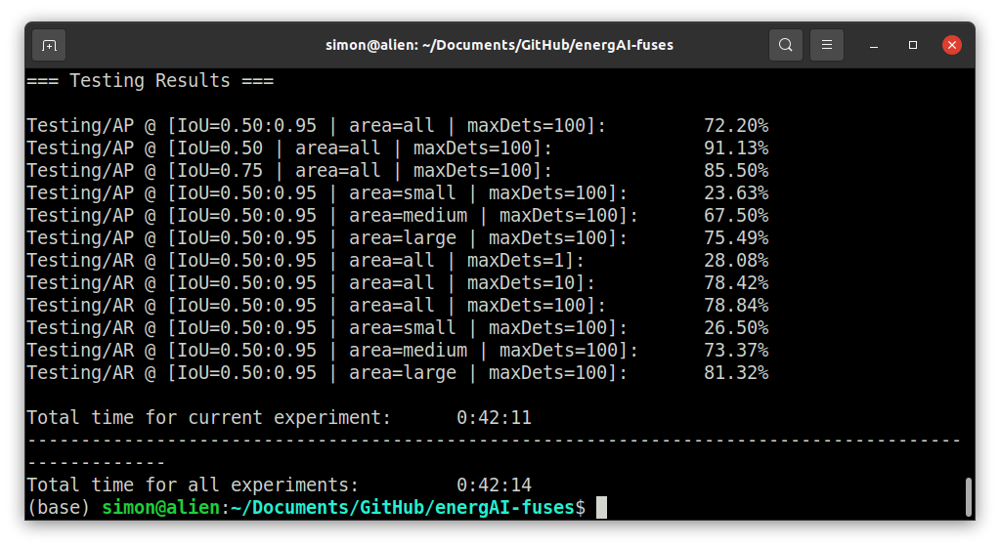

## Module Details: experiment_batch.py

### Description

This file enables users to run a batch of different experiments using the 
developed pipeline. The parameters for each experiment need to be specified 
in a '.json' file. The following structure needs to be followed to specify the 
'.json' batch fixed and variable parameters:
```
{
    "fixed":{
        "-b": "20"
    },

    "variable":{
        "-lr": ["3e-4", "3e-5", "3e-6"],
        "-wd": ["3e-3", "3e-4", "3e-5"]
    }
}
```

The fixed parameters will be fixed for all experiments, while all possible 
combinations of variable parameters will be evaluated. In the above example,
for 3*3=9 total variable parameters combinations possible, the following 
9 experiments will be executed:
```
experiment.py -b 20 -lr 3e-4 -wd 3e-3
experiment.py -b 20 -lr 3e-4 -wd 3e-4
experiment.py -b 20 -lr 3e-4 -wd 3e-5
experiment.py -b 20 -lr 3e-5 -wd 3e-3
experiment.py -b 20 -lr 3e-5 -wd 3e-4
experiment.py -b 20 -lr 3e-5 -wd 3e-5
experiment.py -b 20 -lr 3e-6 -wd 3e-3
experiment.py -b 20 -lr 3e-6 -wd 3e-4
experiment.py -b 20 -lr 3e-6 -wd 3e-5
```

The batch parameters '.json' files for experiment phases A, B, C, D 
and the quick run files are stored inside the '/runs' directory. The '/runs'
directory contains the following '.json' files:
- **A1_fasterrcnn_experiment.json**: Experiment batch for phase A, Faster R-CNN architecture
- **A2_retinanet_experiment.json**: Experiment batch for phase A, RetinaNet architecture
- **A3_detr_experiment.json**: Experiment batch for phase A, DETR architecture
- **B1_size_experiment.json**: Experiment batch for phase B, 512x512 & 1024x1024 image sizes
- **B1_size_experiment_2048.json**: Experiment batch for phase B, 2048x2048 image size (requires around 48 GB VRAM)
- **B2_pretrained_experiment.json**: Experiment batch for phase B, pretrained vs from scratch model
- **B3_gi_experiment.json**: Experiment batch for phase B, Google Images included or excluded
- **C_sensitivity_experiment.json**: Experiment batch for phase C, all 10 initialization seeds
- **C_sensitivity_experiment_1.json**: Experiment batch for phase C, first 5 initialization seeds (split for convenience)
- **C_sensitivity_experiment_2.json**: Experiment batch for phase C, last 5 initialization seeds (split for convenience)
- **D_final_training.json**: Experiment batch for phase D, final model training
- **quick_run.json**: Quick run for low-resource intensive quick model training

### Arguments

| Short 	   | Long              	  | Type | Description                                                                   	 |
|-----------|----------------------|------|---------------------------------------------------------------------------------|
| `-p`    	 | `--path`           	 | str  | Experiment settings .json file path                                             |
``-h``, ``--help``
show this help message and exit

### Examples of basic use:

To run a batch of experiments for which the fixed & variable parameters are
specified in a '.json' file:
```
python experiment_batch.py --path runs/A1_fasterrcnn_experiment.json
```

### Quick Run

A quick run script has been created to allow users with low VRAM GPU's to train
a model with a batch size of 2 for 10 epochs that will produce results in a 
relatively short time. To execute the quick run script:

```
python experiment_batch.py --path runs/quick_run.json
```

After training, testing results will be printed in the console and should be
approximately equal to: 
