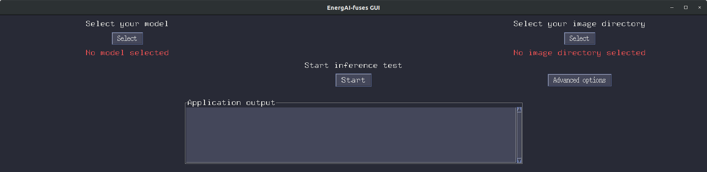
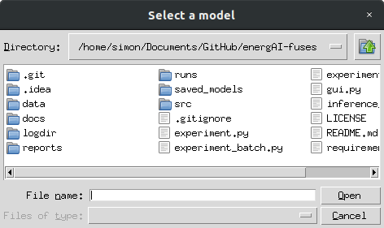
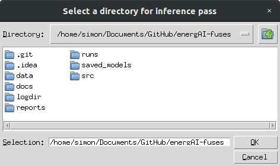
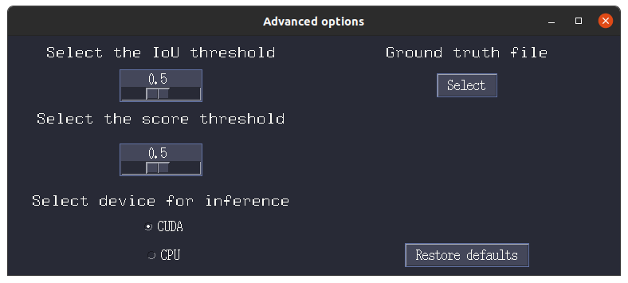
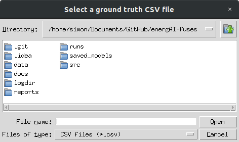
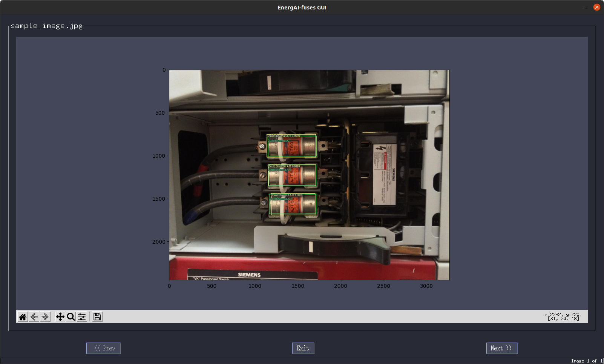

## Module Details: gui.py

### Description

A graphical user interface (GUI) has been created to allow users to 
locate and classify fuses in new pictures. The following window 
is the main GUI window:



The left *Select* button can be pressed to select which trained model to use
for inference. When pressed, the following model selection window 
appears:



The upper right *Select* button can be pressed to select the directory containing
the images on which to perform inference using the selected model. 
Inference will be performed on every picture found in the selected
folder. When pressed, the following image directory window appears:
 


The lower right *Advanced options* button is for advanced options. When pressed, 
the following options window appears: 



The user can choose to add
additional filtering to the bounding boxes being predicted by the model.
If the model chosen is too sensitive or not sensitive enough, an IoU
threshold or *objectness* score threshold can be adjusted with different
effects. For thresholds of 1, all model predictions will be shown. For 
threshold lower than 1, model predictions will be filtered based on the
chosen threshold values. Additionaly, users can choose whether to perform
inference on a CUDA-capable GPU or on a CPU. Furthermore, users can
also select a ground-truth CSV file to show ground truths as well as
predicted bounding boxes at the same time as needed. When
the ground truth file *Select* button is pressed, 
the following options window appears: 



### Examples of basic use:

To start the GUI:
```
python gui.py
```

First, select the desired model, image directory and options, then press
on the center *Start* button to start the inference. After the inference
has been performed, an image viewer with zoom and pan options will 
appear to allow users to view predicted fuses directly on the images. The
following figure shows the inference results obtained on the sample
image available in the repository under 'data/sample/image' (ground truth
boxes are shown in green and model predictions are shown in yellow) :


